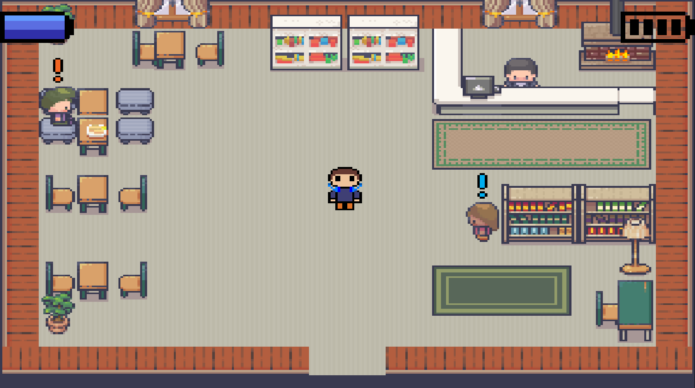

# A Room Full of Eyes

*A GameMaker Studio dissertation project exploring the representation of social anxiety through interactive gameplay.*



## Overview

**I Hate Attending Parties** is a 2D top-down pixel-art game developed as my final-year dissertation project for my BSc (Hons) Computer Science degree.

The project explores how video games can represent experiences of social anxiety through gameplay mechanics rather than traditional storytelling alone.

The game focuses on the concept of a **Social Battery**, a resource that decreases during stressful social interactions and can be restored through coping mechanisms. By turning emotional experiences into interactive systems, the project investigates how games can provide players with a greater understanding of social anxiety.

Players navigate everyday social scenarios, complete objectives, and manage their available resources while experiencing the challenges associated with social situations.

---

# Features

- 🎮 Top-down 2D gameplay built in GameMaker Studio
- 🔋 Social Battery mechanic representing social fatigue
- 🎧 Headphone mechanic inspired by real-world coping strategies
- 💬 NPC interaction and dialogue systems
- 🗺️ Multiple playable social scenarios
- 🎯 Quest and objective-based progression
- 🎨 Pixel-art visual style
- 📊 Custom animated user interface elements
- 🔄 Interactive gameplay systems designed around player choices

---

# Gameplay

The player progresses through several everyday social situations, each presenting different challenges.

Throughout the game, social interactions consume the player's **Social Battery**. When the battery becomes depleted, the player must decide how to manage their remaining resources.

Players can use headphones as a coping mechanism to restore Social Battery. However, headphone usage is limited by a separate battery system, creating a gameplay decision between immediate recovery and conserving resources for future situations.

This creates a gameplay loop based around:

Social interaction -> Social battery depletion -> Decision Making -> Recovery through coping mechanisms -> continue progression

The intention is not to simulate social anxiety perfectly, but to provide an interactive representation of some experiences associated with it.

---

# Technical Implementation

## Social Battery System

The Social Battery system was designed as the central gameplay mechanic.

The system manages:

- Current battery value
- Maximum battery capacity
- Battery depletion from interactions
- Battery recovery
- Animated UI updates

The battery display uses a custom interface created in GameMaker, with the UI separated from gameplay objects using the GUI drawing system.

---

## Headphone System

The headphone mechanic provides the player with a temporary method of recovering Social Battery.

Implementation includes:

- Independent headphone battery tracking
- Animated headphone states
- Player interaction handling
- Resource management between gameplay systems

The mechanic required careful synchronisation between player states, animations and resource values.

---

## Player State Management

The player object manages several gameplay states, including:

- Normal movement
- Interacting with NPCs
- Using headphones
- Updating player animations
- Managing resources

Separating these responsibilities helped keep gameplay logic organised and easier to debug.

---

## Dialogue and Interaction Systems

NPC interactions are handled through a custom dialogue system.

The system supports:

- Player-triggered conversations
- Interaction detection
- Scenario progression
- Gameplay events linked to dialogue
- Branching dialogue

---

# System Design

The overall structure of the game follows a component-based design approach.


This separation allowed individual systems to be developed and tested independently.

---

# Technologies Used

| Technology | Purpose |
|------------|---------|
| GameMaker Studio | Game engine |
| GameMaker Language (GML) | Programming language |
| Git | Version control |
| GitHub | Source management |
| Pixel Art Assets | Game visuals |
| Aseprite | Asset editing |

---

# Development Process

The project was developed iteratively through several stages:

1. Research into social anxiety representation and existing games
2. Design of gameplay mechanics and user experience
3. Implementation of core gameplay systems
4. Development of UI and player interactions
5. User testing and feedback collection
6. Refinement of gameplay mechanics

Academic research into social anxiety, coping mechanisms and interactive media informed the design decisions throughout development.

---

# Challenges

## Designing an Emotional Experience Through Gameplay

One of the biggest challenges was representing an emotional experience through interactive systems.

Instead of relying only on dialogue or narrative, the project required gameplay mechanics that could communicate feelings of pressure, exhaustion and decision-making.

The Social Battery mechanic was designed to transform these abstract experiences into something the player could directly interact with.

---

## Managing Multiple Interacting Systems

The game required several systems to work together:

- Player movement
- NPC interactions
- Dialogue
- Battery calculations
- UI updates
- Animation states

Ensuring these systems remained synchronised required extensive testing and debugging.

---

## Learning Game Development

As GameMaker Studio was a new development environment, the project involved learning:

- Game architecture
- Object management
- Event-based programming
- UI rendering
- Animation systems

---

# Screenshots

## Main Menu


## Gameplay


## Social Battery System


## Headphone Mechanic


---

# Installation

## Requirements

- GameMaker Studio
- Windows operating system

## Running the Game

1. Clone this repository:

```bash
git clone https://github.com/USERNAME/REPOSITORY.git
```
2. Open the project file in GameMaker Studio.
3. Run the project.

